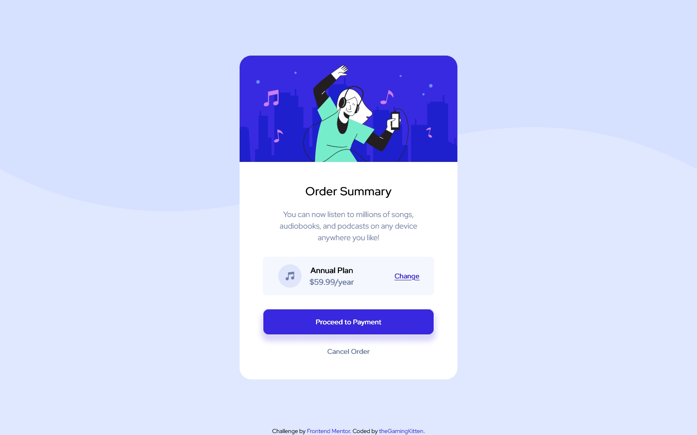

# Frontend Mentor - Order summary card solution

This is a solution to the [Order summary card challenge on Frontend Mentor](https://www.frontendmentor.io/challenges/order-summary-component-QlPmajDUj). Frontend Mentor challenges help you improve your coding skills by building realistic projects. 

## Table of contents

- [Overview](#overview)
  - [The challenge](#the-challenge)
  - [Screenshots](#screenshots)
  - [Links](#links)
- [My process](#my-process)
  - [Built with](#built-with)
  - [What I learned](#what-i-learned)
  - [Continued development](#continued-development)
  - [Useful resources](#useful-resources)
- [Author](#author)

## Overview

### The challenge

Users should be able to:

- See hover states for interactive elements

### Screenshots

### Links

- Solution URL: [Source code](https://github.com/theGamingKitten/order-summary-component-main)
- Live Site URL: [Preview](https://thegamingkitten.github.io/order-summary-component-main/)

## My process

### Built with

- Semantic HTML5 markup
- CSS custom properties
- Flexbox
- Mobile-first workflow
- [Tailwind CSS](https://tailwindcss.com/) - utility-first CSS framework

### What I learned

- Getting better with using Tailwind CSS. Didn't have to look up classes that much compared to first project with Tailwind CSS.

### Continued development

- Will use Tailwind CSS more to get even more comfortable with using it especially with projects that need more CSS and more complex responsive designs.

### Useful resources

- [Tailwind CSS docs](https://tailwindcss.com/) - Documentation for Tailwind CSS

## Author

- Frontend Mentor - [@theGamingKitten](https://www.frontendmentor.io/profile/theGamingKitten)